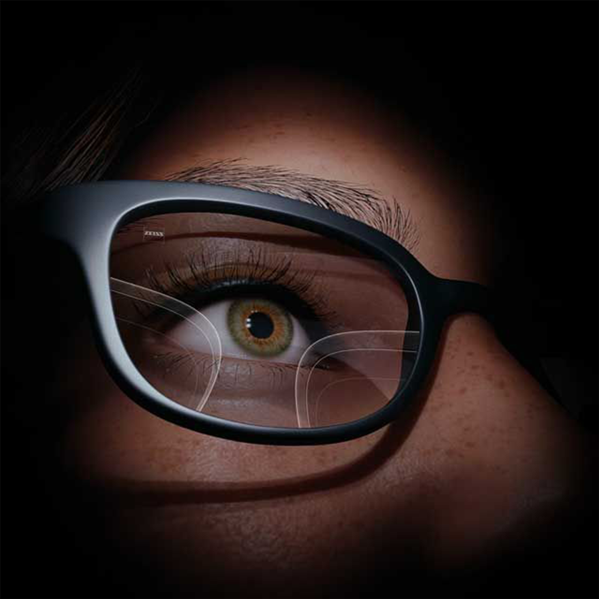

# IMPLEMENTATION_005E.md

Project:
LL-OPTICALV2

Framework:
Applied Engineering AI + Human Intelligence

Status:
READY TO BUILD ✅

---

## Title

Journey Section Final Alignment

---

## Purpose

Refine the "Your Journey" section so `hero3.png` works as an emotional background mood layer instead of a separate side-by-side image card.

The current 005D CSS creates a split layout:

* image on the left
* text/timeline on the right

This feels disconnected from the patient story.

005E fixes that by making the Journey intro feel cinematic, unified, and readable.

---

## Current Issue

The current CSS still uses a desktop side-by-side grid:

```css
@media (min-width: 1024px) {
  .journey .container {
    display: grid;
    grid-template-columns: 1fr 1fr;
  }

  .journey-visual {
    grid-row: 1 / span 2;
  }

  .journey-steps {
    grid-column: 2;
  }
}
```

This must be removed or replaced.

---

## Required New Direction

Use `hero3.png` as a full-width Journey intro background layer.

The Journey section should flow like this:

```text
YOUR JOURNEY

One appointment.
A lifetime of clarity.

[ cinematic hero3 background mood ]
[ floating text card: See clearly. Live confidently. ]

Timeline steps below
01
02
03
04
05
06
07
```

---

## Asset

Use:

```text
assets/images/hero/hero3.png
```

---

## HTML Requirement

Keep the Journey section content.

Preferred structure:

```html
<div class="journey-intro-visual">
  
  <div class="journey-floating-card">
    <span>See clearly.</span>
    <span>Live confidently.</span>
  </div>
</div>
```

Place this after the Journey title and before `.journey-steps`.

---

## CSS Requirements

Remove the side-by-side desktop grid from the Journey section.

Do not set:

```css
.journey .container {
  display: grid;
  grid-template-columns: 1fr 1fr;
}
```

New behavior:

* Journey label and title stay above.
* `hero3.png` appears as a cinematic full-width visual panel.
* Floating text card appears over the image.
* Timeline remains below the visual panel.
* Timeline keeps 2-column layout on desktop.
* Timeline stacks to 1-column on mobile.

---

## Visual Style

The visual panel should use:

* rounded corners
* dark premium overlay
* soft vignette
* Apple/NVIDIA spacing
* documentary mood
* responsive image scaling

The image should not compete with the EYLOTL™ hero.

EYLOTL™ owns the main hero.

`hero3.png` owns the emotional patient journey.

---

## Suggested CSS Direction

```css
.journey-intro-visual {
  position: relative;
  width: 100%;
  margin: var(--sp-8) 0 var(--sp-10);
  border-radius: var(--radius-lg);
  overflow: hidden;
  min-height: 360px;
  box-shadow: 0 24px 70px rgba(0,0,0,0.35);
}

.journey-intro-visual::after {
  content: "";
  position: absolute;
  inset: 0;
  background:
    radial-gradient(circle at 35% 45%, rgba(120,200,255,0.08), transparent 35%),
    linear-gradient(90deg, rgba(8,11,16,0.30), rgba(8,11,16,0.72));
  z-index: 1;
}

.journey-bg-image {
  width: 100%;
  height: 100%;
  min-height: 360px;
  object-fit: cover;
  object-position: center;
}

.journey-floating-card {
  position: absolute;
  left: var(--sp-6);
  bottom: var(--sp-6);
  z-index: 2;
  background: rgba(8,11,16,0.72);
  border: 1px solid rgba(255,255,255,0.08);
  border-radius: var(--radius);
  padding: var(--sp-3) var(--sp-5);
  backdrop-filter: blur(10px);
  color: var(--white);
  font-family: var(--font-display);
  font-style: italic;
  font-size: clamp(1.2rem, 2vw, 1.6rem);
  line-height: 1.25;
  display: flex;
  flex-direction: column;
}

.journey-steps {
  display: grid;
  grid-template-columns: 1fr 1fr;
  gap: var(--sp-2) var(--sp-8);
  margin-top: var(--sp-8);
}

@media (max-width: 768px) {
  .journey-intro-visual {
    min-height: 300px;
    margin: var(--sp-6) 0 var(--sp-8);
  }

  .journey-bg-image {
    min-height: 300px;
  }

  .journey-floating-card {
    left: var(--sp-3);
    right: var(--sp-3);
    bottom: var(--sp-3);
    padding: var(--sp-3);
  }

  .journey-steps {
    grid-template-columns: 1fr;
  }
}
```

---

## Do Not Touch

Do not modify:

* EYLOTL™ hero section
* booking section
* WhatsApp section
* location section
* daily report section
* Spotify/playlist section
* nav behavior
* script.js unless absolutely required

---

## Success Criteria

The Journey section should feel like one continuous story:

```text
Title
↓
Vision emotion
↓
Patient steps
```

Not:

```text
Image block
+
Text block
```

The final result should feel:

* cinematic
* readable
* premium
* calm
* emotionally connected
* aligned with LL-OPTICALV2

---

## VLA Observation

Observation:

The Journey section had strong copy but the first visual enhancement created a split layout that felt disconnected.

Insight:

A background mood image with floating text creates better emotional continuity than a side-by-side layout.

Implementation:

Use `hero3.png` as a cinematic Journey intro background layer with floating caption text.

Expected Result:

Patients feel the story before reading the step-by-step process.

Status:

BUILD NOW ✅
